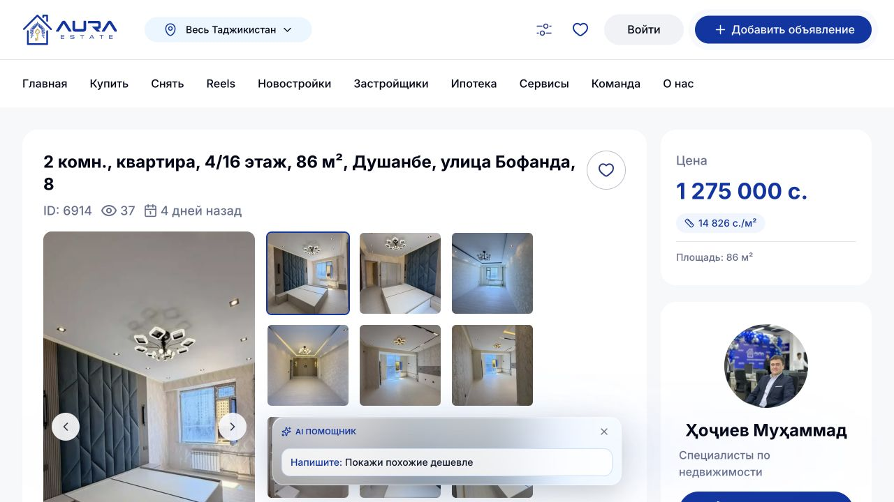
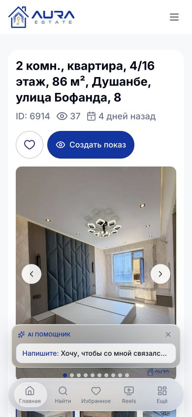

# Техническое задание: ручное обновление даты объявления

## 1. Статус и область работ

Статус: готово к оценке и реализации.

Платформы:

- сайт Aura Estate, страница объекта `/apartment/{id}`;
- приложение Aura Estate для iOS;
- приложение Aura Estate для Android;
- backend API Aura Estate.

Референс страницы: `https://aura.tj/apartment/6914`.

Цель: дать пользователю с уже существующим правом изменения конкретного объекта возможность вручную подтвердить актуальность объявления. Действие обновляет бизнес-дату `listing_updated_at`, но никогда не изменяет дату добавления `created_at`.

## 2. Термины и неизменяемые правила

- `created_at` — дата добавления объявления. После создания объекта не изменяется ни при редактировании, ни при ручном обновлении даты.
- `listing_updated_at` — бизнес-дата актуальности объявления. Именно она меняется после ручного действия «Обновить дату».
- `updated_at` — техническая дата изменения записи. Она не используется в пользовательском интерфейсе как дата объявления и может измениться при выполнении команды.
- Текущее отображение «Добавлено» и «Обновлено» сохраняется.
- Клиент не передаёт новую дату. Время всегда устанавливает backend по серверным часам.
- Ручное обновление даты не изменяет содержимое объявления, автора, агента, статус, фотографии, характеристики и теги.

## 3. Результат для пользователя

Авторизованный пользователь с правом изменения объекта видит кнопку «Обновить дату». После подтверждения:

1. backend устанавливает `listing_updated_at = now()`;
2. `created_at` остаётся прежним;
3. интерфейс без перезагрузки показывает новую строку «Обновлено»;
4. появляется сообщение «Дата объявления обновлена»;
5. действие записывается в историю объекта.

Гость или пользователь без права изменения объекта не видит служебную кнопку.

## 4. Наблюдения по текущему интерфейсу сайта

Текущий desktop-экран:



Текущий mobile web-экран:



На desktop заголовок, ID, просмотры и даты находятся над галереей. Справа от заголовка уже размещаются избранное и, для сотрудников, несколько служебных действий. На узком экране рядом с избранным находится «Создать показ». Добавление ещё одной круглой кнопки без подписи ухудшит понятность и приведёт к переполнению ряда.

Решение: отделить публичные действия от управления объектом. Избранное, связь с агентом и «Создать показ» остаются в своих текущих сценариях. Действия сотрудника собираются в отдельную панель «Управление объявлением».

## 5. Web: расположение и приоритет кнопок

### 5.1. Desktop, ширина от 1024 px

Под строкой с ID, просмотрами и датами, до галереи, добавить панель управления. Панель отображается, если пользователю доступно хотя бы одно служебное действие.

Порядок слева направо:

1. «Редактировать» — основная синяя кнопка с иконкой карандаша.
2. «Обновить дату» — вторичная белая кнопка с синей рамкой и иконкой обновления.
3. «Создать показ» — вторичная кнопка, если действие разрешено текущему пользователю.
4. «Ещё» — кнопка с многоточием, открывающая меню только из доступных действий:
   - «Назначить/изменить соучастника»;
   - «История объекта»;
   - «Модерация».

Избранное остаётся круглой публичной кнопкой справа от заголовка и не смешивается с панелью управления.

Требования к панели:

- высота кнопок 48–52 px;
- текстовые подписи обязательны для «Редактировать» и «Обновить дату»;
- панель переносится на следующую строку без горизонтального скролла;
- меню «Ещё» не содержит действий, запрещённых RBAC;
- опасные действия, если появятся позднее, визуально отделяются и располагаются внизу меню.

### 5.2. Tablet, ширина 768–1023 px

Использовать тот же порядок, но разрешить перенос:

- первая строка: «Редактировать», «Обновить дату»;
- вторая строка: «Создать показ», «Ещё».

### 5.3. Mobile web, ширина менее 768 px

Панель располагается после блока ID/просмотров/дат и до галереи. Она не должна быть фиксированной: на странице уже есть нижняя навигация, поэтому дополнительная sticky-панель перекроет контент.

Композиция:

- первый ряд управления: «Редактировать» и «Обновить дату» — две одинаковые по ширине кнопки;
- кнопка «Ещё» размером не менее 48×48 px располагается справа отдельной ячейкой, если есть дополнительные разрешённые действия;
- существующие «Избранное» и «Создать показ» остаются отдельным публичным рядом;
- при ширине менее 360 px «Редактировать» и «Обновить дату» располагаются вертикально на всю ширину.

Если пользователю разрешено только обновление даты, показывается одна полноширинная кнопка «Обновить дату».

## 6. iOS: расположение и поведение

Текущий экран использует кнопки «Назад», «Поделиться» и «Избранное» поверх hero-фото, а нижняя панель предназначена для связи с агентом. Эти зоны сохраняются без изменений.

Для пользователей с доступными служебными действиями после основной карточки цены/названия и до тегов/карточки агента добавить карточку «Управление объявлением»:

- `Редактировать` — filled-кнопка;
- `Обновить дату` — bordered-кнопка с SF Symbol `arrow.clockwise`;
- `Menu` с иконкой `ellipsis` — история, соучастник и модерация по доступным capability.

На iPhone кнопки имеют высоту не менее 50 pt и располагаются в одной строке, если помещаются. При Dynamic Type XL и выше кнопки переходят в вертикальный режим. Нижняя контактная панель агента не используется для служебных действий.

После успеха карточка дат обновляется из ответа API. VoiceOver получает объявление «Дата объявления обновлена».

## 7. Android: расположение и поведение

Текущий Compose-экран использует верхнюю панель для возврата, а фиксированную нижнюю панель — для чата и звонка агенту. Эти зоны сохраняются.

После hero-карточки объекта и до «О квартире» добавить Material 3-карточку «Управление объявлением»:

- `FilledButton` «Редактировать»;
- `OutlinedButton` «Обновить дату» с `Icons.Outlined.Refresh`;
- `IconButton` «Ещё» с семантическим `contentDescription`.

Минимальная зона касания — 48×48 dp. При недостатке ширины две текстовые кнопки располагаются вертикально. Контактная bottom bar агента остаётся без служебных действий.

После успеха состояние объекта и локальный кэш обновляются ответом сервера. Команда обновления даты не ставится в offline-очередь: серверное время должно быть фактическим временем выполнения. При отсутствии сети пользователь видит Snackbar «Нет соединения. Попробуйте ещё раз».

Примечание по репозиторию Android: локальный worktree пуст, поэтому ТЗ сверено с `origin/main`, где экран находится в `AnnouncementDetailScreen.kt`.

## 8. Диалог подтверждения

Нажатие «Обновить дату» не отправляет запрос немедленно. На всех платформах открывается нативный диалог или bottom sheet.

Текст:

- заголовок: «Обновить дату объявления?»;
- описание: «Объявление будет отмечено как актуальное. Дата добавления останется без изменений.»;
- основное действие: «Обновить»;
- отмена: «Отмена».

После нажатия «Обновить»:

- кнопка блокируется;
- показывается progress-индикатор и подпись «Обновляем…»;
- повторный запрос до завершения первого запрещён;
- диалог закрывается только после успешного ответа либо показывает ошибку без потери контекста.

## 9. Состояния кнопки

| Состояние | Отображение |
|---|---|
| Нет права | Кнопка отсутствует |
| Можно обновить | Активная кнопка «Обновить дату» |
| Запрос выполняется | Disabled, spinner, «Обновляем…» |
| Cooldown | Disabled, «Можно обновить через …»; на desktop также tooltip с точным временем |
| Объект не опубликован | Кнопка отсутствует; причина доступна в меню/служебной карточке только при необходимости |
| Ошибка 401 | Переход в существующий сценарий авторизации |
| Ошибка 403 | Кнопка скрывается после обновления capability, сообщение «Недостаточно прав» |
| Ошибка сети/5xx | Кнопка снова активна, сообщение «Не удалось обновить дату. Попробуйте ещё раз» |

## 10. RBAC: обязательное переиспользование существующего доступа

Новая команда не создаёт отдельную матрицу ролей и не расширяет права. Backend обязан использовать тот же механизм, что уже защищает изменение объекта: `authorizePropertyMutation()` / `canMutateProperty()`.

Текущее серверное правило, которое должно быть переиспользовано без ослабления:

1. `admin` и `superadmin` — любой объект.
2. Пользователь, совпадающий с `created_by` или `agent_id`, — свой/назначенный объект.
3. Пользователь, совпадающий с `co_owner_user_id`, — объект, где он соучастник.
4. `mop` — объект в своей `branch_group_id`, если группа определена.
5. `rop` и `branch_director` — объект своего филиала.
6. Остальные случаи — запрет. Само наличие авторизации или роли сотрудника права не даёт.

Backend остаётся единственным источником истины. Проверка на Web/iOS/Android нужна только для отображения интерфейса и не заменяет серверную авторизацию.

### 10.1. Capability в ответе объекта

Чтобы три клиента не копировали RBAC и не расходились с backend, в авторизованный ответ `GET /api/properties/{property}` добавить:

```json
{
  "capabilities": {
    "can_edit": true,
    "can_refresh_listing_date": true,
    "can_view_history": true,
    "can_moderate": false,
    "can_manage_co_owner": true
  },
  "listing_date_refresh": {
    "available": true,
    "next_available_at": null
  }
}
```

Для гостя все служебные capability равны `false` либо блок `capabilities` отсутствует по единому принятому API-контракту.

Важно: новую кнопку нельзя показывать только по текущему frontend-хелперу `canEditProperty()`. В существующем коде Web его логика частично отличается от backend по `marketing`, `mop` и соучастнику. Для новой команды используется `capabilities.can_refresh_listing_date`; 403 всё равно обрабатывается как окончательное решение сервера.

## 11. Ограничение частоты и доступный статус

Ручное подтверждение актуальности влияет на сортировку, поэтому требуется защита от многократного поднятия объявления:

- cooldown по умолчанию — 24 часа с последнего ручного обновления;
- значение хранится в конфигурации backend;
- правило одинаково для всех ролей, имеющих доступ;
- параллельные запросы защищаются транзакцией/блокировкой;
- при cooldown API возвращает `409 Conflict`, код `LISTING_DATE_REFRESH_COOLDOWN` и `next_available_at`;
- ручное обновление доступно только для опубликованного объекта с `moderation_status = approved`;
- для `draft`, `pending`, `rejected`, `denied`, `deposit`, `sold`, `rented`, `sold_by_owner`, `deleted` capability равен `false`.

Если продукт решит отказаться от cooldown, это должно быть отдельным согласованным изменением данного ТЗ, поскольку без ограничения кнопку можно использовать для постоянного поднятия выдачи.

## 12. Backend API

### 12.1. Endpoint

```http
POST /api/properties/{property}/refresh-listing-date
Authorization: Bearer <token>
Accept: application/json
```

Тело запроса пустое. Клиенту запрещено передавать дату.

Успешный ответ `200 OK`:

```json
{
  "message": "Дата объявления обновлена",
  "data": {
    "id": 6914,
    "created_at": "2026-08-10T09:00:00.000000Z",
    "listing_updated_at": "2026-08-14T11:45:00.000000Z",
    "capabilities": {
      "can_refresh_listing_date": false
    },
    "listing_date_refresh": {
      "available": false,
      "next_available_at": "2026-08-15T11:45:00.000000Z"
    }
  }
}
```

Ошибки:

- `401` — не авторизован;
- `403` — существующий RBAC не разрешает изменение объекта;
- `404` — объект не найден;
- `409 LISTING_DATE_REFRESH_COOLDOWN` — cooldown ещё не завершён;
- `422 LISTING_DATE_REFRESH_STATUS_NOT_ALLOWED` — статус объекта не допускает обновление;
- `500` — внутренняя ошибка, дата не должна измениться частично.

### 12.2. Серверная последовательность

1. Найти объект.
2. Выполнить существующий `authorizePropertyMutation($property)`.
3. Проверить допустимый статус.
4. В транзакции заблокировать строку объекта и повторно проверить cooldown.
5. Сохранить старые `created_at` и `listing_updated_at`.
6. Вызвать существующий `markListingUpdated(now())`.
7. Проверить, что `created_at` не изменился.
8. Создать запись истории.
9. Вернуть новые даты и capability.

## 13. История и аудит

Создать событие истории объекта:

- `action`: `listing_date_refreshed`;
- `property_id`;
- `actor_id`;
- `old_listing_updated_at`;
- `new_listing_updated_at`;
- `created_at` события;
- источник запроса, если он уже определяется существующей инфраструктурой (`web`, `ios`, `android`).

В пользовательской истории показывать: «{Пользователь} обновил дату объявления: {старая дата} → {новая дата}».

Не писать токены, IP-адреса и лишние персональные данные в payload события.

## 14. Модели клиентов

### Web

- добавить метод сервиса `refreshListingDate(propertyId)`;
- типизировать `capabilities` и `listing_date_refresh`;
- после успеха обновить React Query/локальное состояние объекта данными ответа;
- не делать оптимистическую подмену времени до ответа сервера.

### iOS

- добавить `listingUpdatedAt`, `capabilities` и `listingDateRefresh` в модель `Property`;
- добавить метод репозитория `refreshListingDate(propertyID:)`;
- использовать существующий профиль/`AuthorizedWorkspaceAccess` только как вспомогательный UI-контекст, а финальное отображение действия строить по capability объекта;
- после успеха заменить объект в `PropertyDetailsViewModel` ответом API и обновить кэш/списки.

### Android

- добавить даты, capability и данные cooldown в `AnnouncementDetailContext`/DTO;
- добавить `POST` в `AnnouncementDetailApi` и метод репозитория;
- добавить события `RefreshListingDateClicked`, `ConfirmRefreshListingDate`, `DismissRefreshListingDate`;
- хранить `isRefreshingListingDate` в `AnnouncementDetailUiState`;
- после ответа обновить detail state и локальную Room-запись;
- не выполнять optimistic update и не ставить запрос в offline queue.

## 15. Доступность и локализация

- Web: кнопка доступна с клавиатуры, имеет видимый focus-ring и `aria-label="Обновить дату объявления"`.
- iOS: accessibility label «Обновить дату объявления», hint «Подтверждает актуальность, не меняя дату добавления».
- Android: аналогичный `contentDescription`; Snackbar объявляется TalkBack.
- Минимальный target: 44×44 px/pt для Web и iOS, 48×48 dp для Android.
- Состояние нельзя обозначать только цветом: используются текст, spinner и disabled-состояние.
- Все строки проходят через существующую систему локализации. Русские тексты из ТЗ являются базовыми.

## 16. Метрики

Если в проекте включена продуктовая аналитика, отправлять:

- `listing_date_refresh_opened`;
- `listing_date_refresh_confirmed`;
- `listing_date_refresh_succeeded`;
- `listing_date_refresh_failed` с безопасным `error_code`;
- параметры: `property_id`, `platform`, `role_slug`, `cooldown_remaining_bucket`.

Не отправлять токен, телефон, адрес объекта или текст объявления.

## 17. Критерии приёмки

### Данные и API

- После успешного запроса `listing_updated_at` становится серверным текущим временем.
- `created_at` до и после запроса совпадает до микросекунды.
- Клиент не может установить произвольную дату.
- Повторный запрос в период cooldown возвращает 409 и не меняет даты.
- Параллельные запросы не обходят cooldown.
- Для неопубликованного объекта команда отклоняется.
- В истории присутствует одно корректное событие на одно успешное обновление.

### RBAC

- Разрешение команды совпадает с существующим серверным правом изменения этого же объекта.
- Владелец/назначенный агент/соучастник получает доступ только к соответствующему объекту.
- МОП ограничен своей группой филиалов.
- РОП и директор филиала ограничены своим филиалом.
- `admin` и `superadmin` имеют доступ ко всем опубликованным объектам.
- Пользователь без права получает 403 даже при прямом вызове endpoint.
- Скрытие кнопки на клиенте не считается защитой.

### Web

- На desktop служебная панель расположена между метаданными и галереей; избранное остаётся отдельно.
- На mobile web панель не перекрывает нижнюю навигацию.
- Текст «Обновить дату» не заменён иконкой без подписи.
- После успеха дата обновляется без полной перезагрузки страницы.

### iOS

- Управление находится под summary-card, а не в hero и не в контактной bottom bar.
- Layout корректен при Dynamic Type и VoiceOver.
- При offline запрос не ставится в очередь.

### Android

- Управление находится под hero-card, а не в контактной bottom bar.
- Layout корректен на ширине 320 dp и при увеличенном шрифте.
- TalkBack читает назначение кнопки и результат операции.

## 18. Тесты

Backend feature-тесты:

- успешное обновление;
- неизменность `created_at`;
- отсутствие произвольной даты в контракте;
- полный набор RBAC-сценариев и scope;
- недопустимые статусы;
- cooldown и конкурентные запросы;
- запись истории.

Web component/e2e:

- отображение панели по capability;
- отсутствие кнопки без capability;
- порядок действий на desktop/mobile;
- confirm/cancel/loading/success/error/cooldown;
- обновление `<time>` после ответа.

iOS unit/UI:

- декодирование capability и дат;
- состояния ViewModel;
- подтверждение и обработка ошибок;
- snapshot/UI test обычного и увеличенного шрифта.

Android unit/UI:

- DTO/Room mapping;
- reducer/ViewModel для всех состояний;
- Compose test доступности и адаптивной раскладки;
- отсутствие offline queue для команды.

## 19. Порядок реализации

1. Backend: endpoint, capability, статус, cooldown, аудит и feature-тесты.
2. Web: новая панель управления, диалог и обновление даты.
3. iOS: модели/API/ViewModel/UI.
4. Android: checkout `origin/main`, модели/API/ViewModel/Compose UI.
5. Сквозной RBAC regression и проверка одного объекта под каждой ролью.
6. Поэтапный выпуск: backend → Web → iOS/Android.

## 20. Вне рамок задачи

- изменение `created_at`;
- массовое обновление дат списка объектов;
- автоматическое расписание поднятия объявлений;
- платное продвижение/VIP;
- изменение существующей ролевой модели;
- перенос контактных или публичных действий на новые места.
